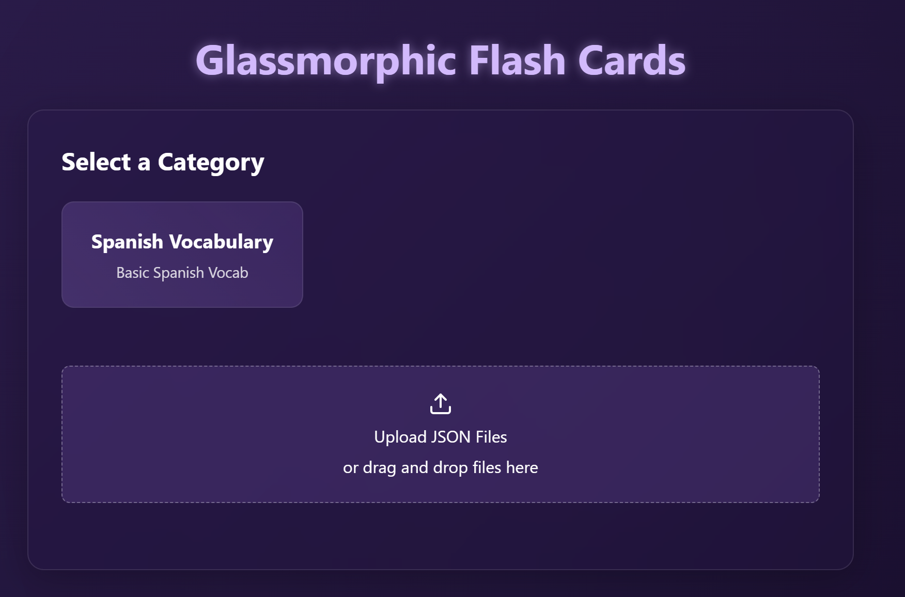
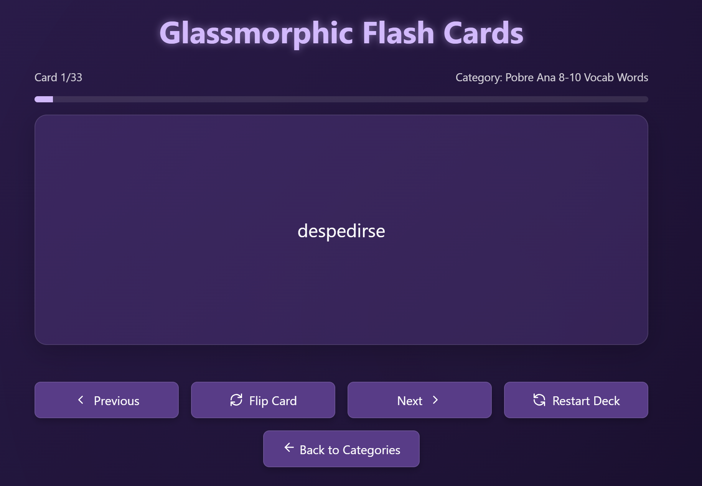

# Glassmorphic Flash Cards

A simple, web-based, easy to use flashcard application with a modern purple glassmorphic design. It allows you to study flashcards organized into categories loaded from JSON files, either pre-configured ones or files uploaded directly by you.

## Features

*   **Category Selection:** Upload and save JSON files on the site for easy deck access, or add categories as a site owner.
*   **Interactive Flashcards:** Click or press space/enter to flip cards.
*   **Navigation:** Navigate between cards using buttons or arrow keys.
*   **Progress Tracking:** See your progress through the current deck.
*   **JSON File Upload:** Load your own flashcard decks from JSON files, saved in your browser's local storage.
*   **Responsive Design:** Works well on various screen sizes.
*   **Glassmorphic UI:** Modern, transparent design elements.

## Screenshots

### Category Selection



### Flashcard View



## JSON Card Format

The web app loads flashcard data from JSON files. Each JSON file should represent a single category (or deck) of flashcards.

The required format is a JSON file with the following structure:

```json
{
  "title": "Your Category Title",
  "cards": [
    { "front": "Content on the front of the card", "back": "Content on the back of the card" },
    { "front": "Another card's front", "back": "Another card's back" }
    // ... more card objects
  ]
}
```

*   `title` (Optional): A string representing the title of the flashcard category. If not provided, the filename (without `.json`) will be used as the category name.
*   `cards` (Required): An array of card objects.
*   Each object within the `cards` array must have:
    *   `front` (Required): A non-empty string for the content displayed on the front of the card.
    *   `back` (Required): A non-empty string for the content displayed on the back of the card.

Example (`spanish-3686.json`):

```json
{
  "title": "Spanish Vocabulary",
  "cards": [
    { "front": "Hello", "back": "Hola" },
    { "front": "Goodbye", "back": "Adiós" },
    { "front": "Thank you", "back": "Gracias" },
    { "front": "Please", "back": "Por favor" },
    { "front": "Yes", "back": "Sí" },
    { "front": "No", "back": "No" },
    { "front": "Excuse me", "back": "Disculpe" },
    { "front": "How are you?", "back": "¿Cómo estás?" }
  ]
}
```

To use your own cards, create a JSON file with this structure and upload it using the "Upload JSON Files" section on the category selection screen. They will be saved in the site for as long as you do not not clear your browser cache.